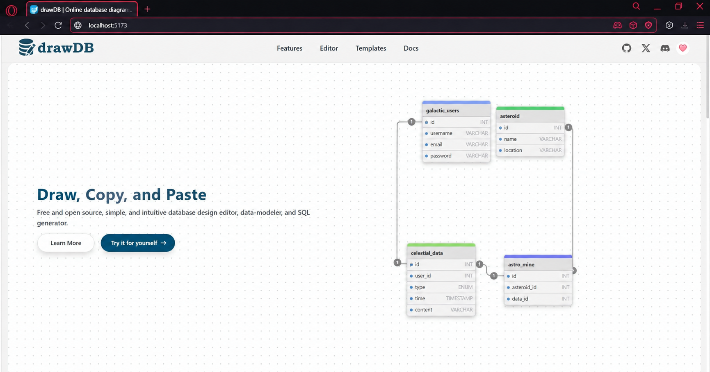

<div align="center">

# 🗄️ DrawDB в Docker

**Бесплатный, простой и интуитивно понятный редактор схем баз данных и генератор SQL прямо в браузере.**

[](https://github.com/drawdb-io/drawdb)
[](https://www.docker.com/)
[](https://github.com/drawdb-io/drawdb/blob/main/LICENSE)

</div>

---

## 📖 О проекте

**DrawDB** — это мощный инструмент для проектирования баз данных, который работает прямо в вашем браузере. С его помощью можно создавать сложные ER-диаграммы, экспортировать их в SQL и делиться схемами с коллегами.

> 🔗 **Официальный репозиторий:** [github.com/drawdb-io/drawdb](https://github.com/drawdb-io/drawdb)

---

## ⚠️ Подготовка перед запуском

Перед началом работы над этим проектом **проверьте другие запущенные у вас `docker-compose` приложения**:

```shell
docker compose ls
```

> 💡 **Совет:** Лучше остановить лишние контейнеры, чтобы снизить риск возникновения конфликтов использования портов!

---

## 🚀 Пошаговая инструкция

### Шаг 1. 📥 Получение drawDB из аппстрима

> **Аппстрим (appstream)** — автор-разработчик, предоставляющий единую инфраструктуру для описания своего программного обеспечения.

Клонируем репозиторий в корень домашней папки текущего пользователя (`cd ~`):

```shell
git clone https://github.com/drawdb-io/drawdb
```

Переходим в локальную папку склонированного репозитория:

```shell
cd drawdb/
```

---

### Шаг 2. 🐳 Установка и запуск drawDB локально

Запускаем проект в фоновом режиме:

```shell
docker compose up -d
```

Убеждаемся, что проект успешно запущен:

```shell
docker compose ls
```

> ⏳ **Внимание!** Проекту нужно несколько минут для запуска контейнера. Подождите немного, прежде чем открыть его в браузере.

<div align="center">

### 🌐 [Открыть DrawDB локально в браузере](http://localhost:5173/)

</div>



---

## 🗑️ Полное удаление проекта

Если вы хотите полностью избавиться от проекта, выполните следующие шаги.

### 🔧 Детальный способ

**1. Остановить контейнер с удалением данных:**

```shell
docker compose down -v
```

**2. Проверить, не запущен ли удаляемый контейнер:**

```shell
docker ps -a
```

```shell
docker compose ps -a
```

**3. Получить `id` образа:**

```shell
docker images
```

**4. Удалить образ:**

```shell
docker rmi <id-образа>
```

**5. Удалить каталог проекта:**

```shell
rm -rf drawdb
```

---

### ⚡ Упрощённый способ

**1. Остановить и удалить контейнер вместе с данными и образами:**

```shell
docker compose down --rmi all -v
```

**2. Выйти из каталога проекта:**

```shell
cd ..
```

**3. Удалить каталог проекта:**

```shell
rm -rf drawdb
```

---

<div align="center">

### ⭐ Если проект был полезен — поставьте звезду оригинальному репозиторию!

**Сделано с ❤️ для удобной работы с базами данных**

</div>